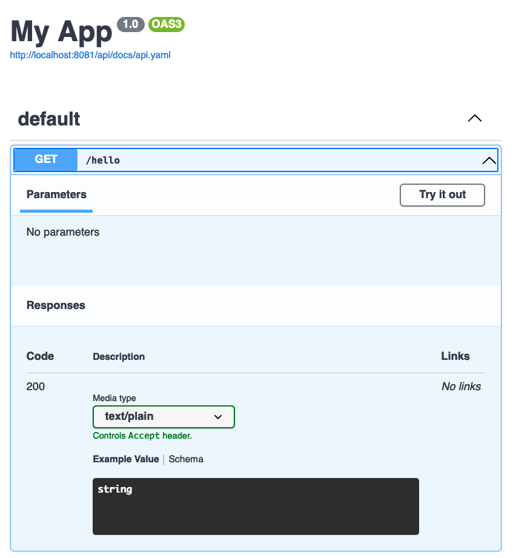

# SNUnit + Tapir + OpenApi docs

This example shows how to server the OpenApi documentation for the Tapir
API running on Scala Native with NGINX Unit

## How to run the example

In a terminal:
```
unitd --log /dev/stdout --no-daemon
```

This assumes that the control socket is in /usr/local/var/run/unit/control.sock
update `build.sc` if it's not the case for you (run `unitd --help` to get the default control socket)

Then run `./mill -w deploy` to deploy the application.

## Test the example

Call the endpoint:

```
curl http://127.0.0.1:8081/hello
Hello world!⏎
```

Get the generated OpenApi file:

```
curl http://127.0.0.1:8081/api/api.yaml
```
```yaml
openapi: 3.0.3
info:
  title: My App
  version: '1.0'
paths:
  /hello:
    get:
      operationId: getHello
      responses:
        '200':
          description: ''
          content:
            text/plain:
              schema:
                type: string
```

Open the documentation website in your browser:

```
open "http://localhost:8081/api/docs"
```

